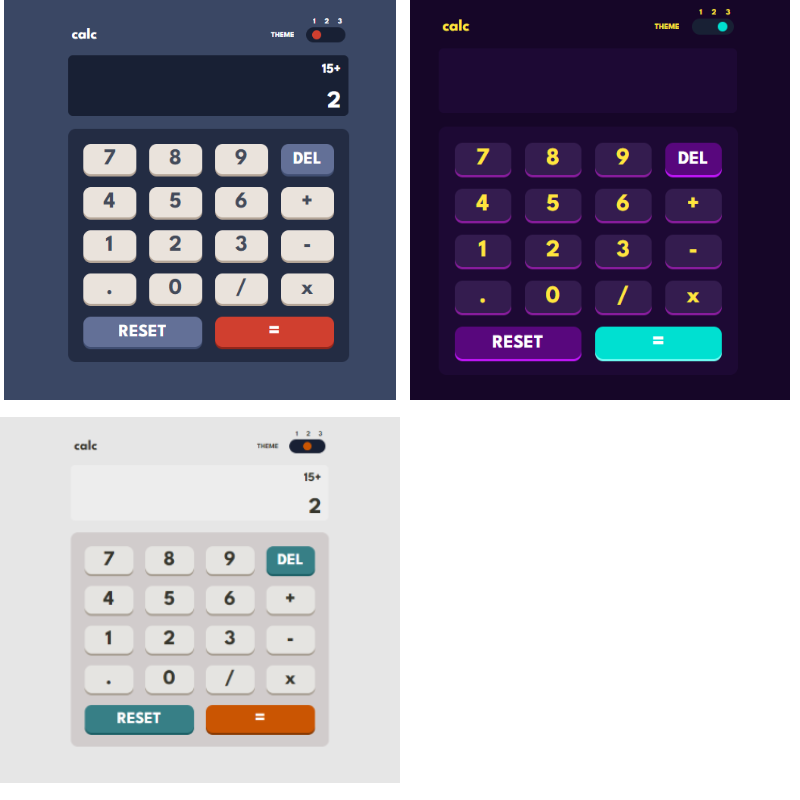

# Calculator app solution

## Table of contents

- [Overview](#overview)
  - [Screenshot](#screenshot)
  - [Links](#links)
- [My process](#my-process)
  - [Built with](#built-with)
  - [What I learned](#what-i-learned)
- [Author](#author)

## Overview

Users should be able to:

- Perform mathematical operations like addition, subtraction, multiplication, and division
- Adjust the color theme based on their preference

### Screenshot

### Links

- Live Site URL: [Live Demo](https://calculator-karim-ashraf.netlify.app/)

### Built with

- Semantic HTML5 markup
- CSS custom properties
- Flexbox
- CSS Grid
  -Javascript

### What I learned

How to add a three-state-button to my code

## Author

- Website - [Karim Ashraf](https://www.linkedin.com/in/karim-ashraf-72k/)
